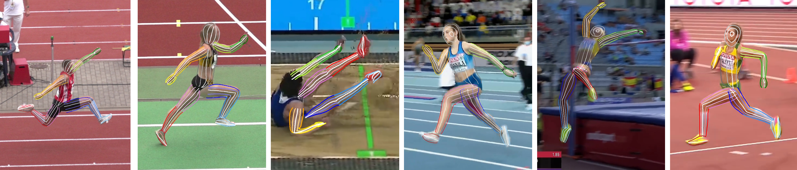

# All Keypoints You Need: Detecting Arbitrary Keypoints on the Body of Triple, High, and Long Jump Athletes



This repository is the official implementation of 
[All Keypoints You Need: Detecting Arbitrary Keypoints on the Body of Triple, High, and Long Jump Athletes](https://arxiv.org/abs/2304.02939). 

The paper is accepted for [CVSports'23](https://vap.aau.dk/cvsports/) at 
[CVPR'23](https://cvpr2023.thecvf.com). 

## Dataset

You can download the dataset [here](https://www.uni-augsburg.de/en/fakultaet/fai/informatik/prof/mmc/research/datensatze/). 
After downloading, you need to download the videos from YouTube and extract the annotated frames. 
The annotated frames are expected to be located in a folder that has subfolders for each video (named by its index)
and each subfolder contains the frames with the following naming convention: `<video_id>_(<frame_num>).jpg`,
whereby the frame number is five-digit, e.g.`<frames_path>/0/0_(01944).jpg`.

To use this code, it is expected that the extracted frames are located in a subfolder called `annotated_frames`. Hence, the dataset structure should look like this:

    jump-broadcast
    ├── annotated_frames        # Extracted frames
    │   ├── 0                   # Frames of video 0
    │   │   ├── 0_(01944).jpg
    │   │   └── ...
    │   └── ...                  
    ├── keypoints               # Keypoint annotations
    │   ├── train.csv           
    │   └── val.csv
    ├── Readme.md
    ├── segmentations           # segmentation masks
    │   ├── 0_(01944).jpg       
    │   └── ...               
    ├── video_download_links.txt                  
    └── video_indices.txt


## Installation

Install all requirements in `requirements.txt`.
Before running, you need to adjust the paths in `paths.py`. You need to set the path to the downloaded dataset (`YTJumpLoc.base_path`) and a path for the logs (`GeneralLoc.log_path`), where the evaluation files and training logs will be dumped. 

## Evaluation

After installing all requirements and adjusting the paths, you can run the evaluation script with our trained weights. They are located in `transformer/pretrained_weights/`. If you run the following command, the evaluation for all three encoding variants is executed and the results displayed. You can adjust the GPU and the batch size to fit your GPU. You can also define the subset to evaluate on. The default is the validation set.

```bash
python -m transformer.evaluation.yt_jump.yt_jump_evaluation [--gpu <gpu_num> --bs <batch_size> --subset <subset>]
```

A visualization of the results is also possible. See section [Visualization](#visualization) for more details.

## Training
The pretrained weights for training are based on the COCO dataset and pretrained on arbitrary keypoints on only the limbs. They are located in `transformer/pretrained_weights/coco_arbitrary_limbs.pth.tar`.

You can adjust the training settings in the config file located at `transformer.experiments.jump.yt_jump_segmentation_config.py`. The keypoint encoding and embedding settings are defined by the parameter `TOKEN_EMBEDDING`. The default is the representation as keypoint vectors with angle encoding for the head, and a two layer embedding, as this setting achieves the best results in our trainings.

To start training on a GPU, run the following command. You might need to adjust the batch size to fit your GPU. This setting can be found in `transformer.experiments.transformer_config.py` and is called `SINGLE_GPU_BATCH_SIZE`.

Before training starts for the first time, some additional files will be generated which contain the endpoints, the anchor points, and the validation points. This process will takes some time. 

```bash
python -m transformer.main [--gpu <gpu_num>]
```

The training routine will create output in the defined log directory. Tensorboard logs in  `<log_dir>/yt_jump/tensorboard` and weights in `<log_dir>/yt_jump/weights`. 

## Visualization

To visualize the grond truth creation or the model predictions, we offer visualization tools created with [streamlit](https://streamlit.io/).

### Ground Truth Generation

To start the ground truth visualization, run the following command:

```bash
 python -m streamlit run datasets/jump/visualization/streamlit_vis_jump_creation.py
```

In the sidebar, you can choose the representation type, either normalized pose or keypoint vectors with angle encoding or extension encoding for the head. You can choose any image from the dataset and select one of the following visualization options:

- None: Display only the image with segmentation mask and fixed keypoints.
- Single Point: Display the creation of a specified single keypoint. You can choose the body part in the sidebar below and adjust the projection point and the thickness with the sliders. By selecting the *show creation details* checkbox, either the keypoint vectors or the normalized pose with the corresponding keypoints will be displayed as well.
- Lines: multiple lines on one bodypart are displayed, with color coding from one side to the other. The lines are basically only lots of points that are very close to each other.
- Validation: Display all points that are used during evaluation for all body parts.

### Model Predictions

To start the visualization of the model predictions, run the following command:

```bash
 python -m streamlit run transformer/evaluation/yt_jump/streamlit_vis_yt_jump_model.py -- --weights <weights_file> [--gpu <gpu_id> --subset <subset> --model_name <model_name>]
```
As weights file, you can either choose one of our trained weights from `transformer/pretrained_weights/<file.pth.tar>` or select a file that you trained yourself. You can also specify the name of the model to use (e.g, the EMA model), the GPU to use, and the subset to evaluate on.

In the sidebar, you can choose the visualization type:

- Fixed points: Display the predicted fixed keypoints
- Grid: Display a grid of points on each body part
- Lines: Display lines of arbitrary points on each body part. The number of lines can be chosen on the bottom of the sidebar

You can further select an image from the subset and choose which body parts are included in the visualization.

## Citation
In case this work is useful for your research, please consider citing:

    @InProceedings{ludwig2023all_kps,
    title     = {All Keypoints You Need: Detecting Arbitrary Keypoints on the Body of Triple, High, and Long Jump Athletes},
    author    = {Ludwig, Katja and Lorenz, Julian and Sch{\"o}n, Robin and Lienhart, Rainer},
    booktitle = {Proceedings of the 2023 IEEE/CVF International Conference on Computer Vision and Pattern Recognition Workshops (CVPRW)}},
    month     = {June},
    year      = {2023},
}


## Acknowledgments

Our code is heavily influenced by the following projects:

* [TokenPose](https://github.com/leeyegy/TokenPose)
* [HigherHRNet](https://github.com/HRNet/HigherHRNet-Human-Pose-Estimation)

We are grateful to the corresponding authors for releasing their code. We use some of their code in our project.